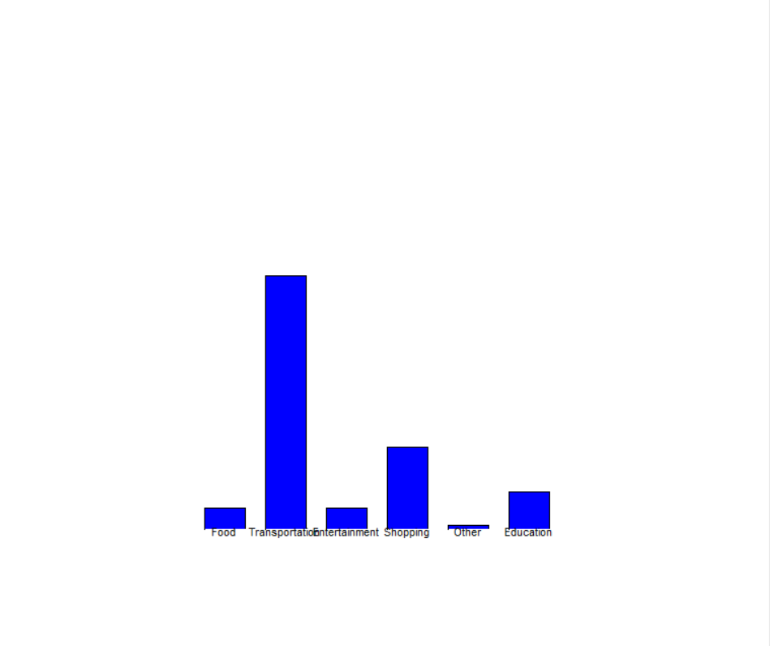

# Personal Expense Tracker 💰📊

A console-based Personal Expense Tracker application built with Python. This project utilizes Object-Oriented Programming (OOP) principles to manage, store, and visualize daily expenses and budgets.

## Features
* **Add Expenses:** Record your daily expenses with specific categories, amounts, dates, and descriptions. Includes date format validation (YYYY-MM-DD).
* **View Expenses:** Display all expenses in a well-formatted table or group them by category.
* **Delete Expenses:** Easily remove incorrect or unwanted expense entries using their unique IDs.
* **Budget Management:** Set budget limits for different categories and receive alerts if you exceed them.
* **Data Visualization:** Automatically generates a bar chart of your expenses using Python's built-in `turtle` graphics module.

* **Persistent Storage:** Safely stores all expense and budget data in JSON format (`expenses.json` and `budget.json`).

## Technologies Used
* **Python 3.x**
* **JSON** (for data storage)
* **Turtle Graphics** (for bar chart visualization)
* **Datetime** (for input validation)

## How to Run the Project
1. Clone this repository to your local machine:
   git clone [https://github.com/FurkanComert1/expense-tracker-python.git](https://github.com/FurkanComert1/expense-tracker-python.git)

2. Navigate to the project directory:
   cd expense-tracker-python

3. Run the application:
   python main.py

*(Note: Ensure your main python file is named main.py)*

## Author
**Muhammet Furkan Cömert**
Computer Engineering Student